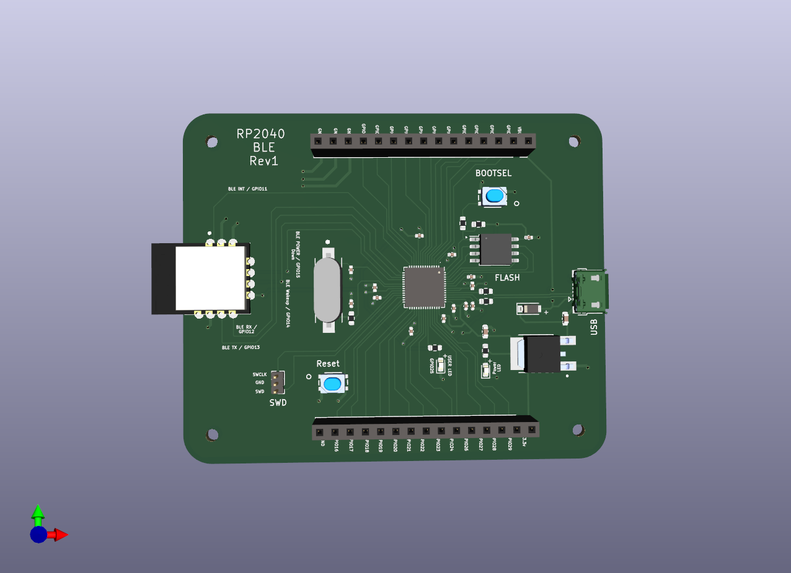
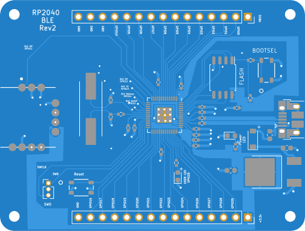
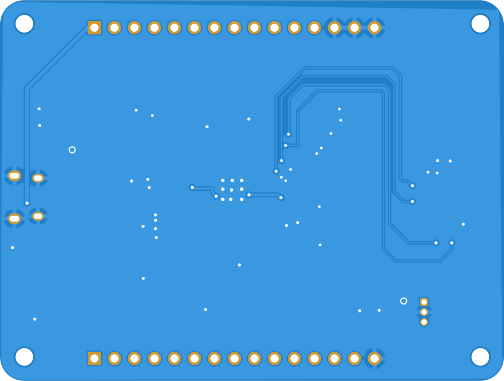

# RP2040 BLE

A PCB that uses RP2040 MCU and HM-BT4502 BLE passthrough module.
This enables the RP2040 to communicated with other devices using Bluetooth.
The bluetooth module is connected via UART(0)

## 3D

## PCB front layer

## PCB back layer

## Generating board images
I used the gerber viewer on [PCBWay](https://www.pcbway.com/project/OnlineGerberViewer.html),
Downloaded the SVG renders from it, then converted the top and bottom SVGs to PNGs

## Helpful tutorials
- [The RP2040 hardware design guide, its in depth and cover things nicely](https://datasheets.raspberrypi.com/rp2040/hardware-design-with-rp2040.pdf)
- [An Intro to KiCad – Part 1: How PCBs Are Made](https://www.youtube.com/watch?v=vaCVh2SAZY4&list=PLEBQazB0HUyR24ckSZ5u05TZHV9khgA1O&ab_channel=Digi-Key)
- [Hardware Design with the RP2040: Custom PCB Based on the Raspberry Pi Pico](https://www.youtube.com/watch?v=kcwvuwetgEQ&ab_channel=Digi-Key)
- [Raspberry Pi RP2040 Hardware Design](https://www.youtube.com/watch?v=X00Cm5LMNQk&ab_channel=Phil%E2%80%99sLab)
- [KiCad STM32 + USB + Buck Converter PCB Design](https://www.youtube.com/watch?v=C7-8nUU6e3E&ab_channel=Phil%E2%80%99sLab)
- [KiCad 6 STM32 PCB Design Full Tutorial ](https://www.youtube.com/watch?v=aVUqaB0IMh4&ab_channel=Phil%E2%80%99sLab)
- [Designing a PCB for the RP2040 Microcontroller](https://www.teachmemicro.com/designing-a-pcb-for-the-rp2040-microcontroller/)
## Credits
- Most of the tutorial videos are from [Shawn Hymel](https://www.youtube.com/c/ShawnHymel), [Phil’s Lab](https://www.youtube.com/c/PhilS94).
They have amazing content do check them out.
- [Reddit PCB review thread](https://www.reddit.com/r/PrintedCircuitBoard/comments/wz8so7/pcb_review_rp2040_based_ble_board/),
thank you [Worldly-Protection-8](https://www.reddit.com/user/Worldly-Protection-8/), [DNosnibor](https://www.reddit.com/user/DNosnibor/) for the valuable review and feedback.