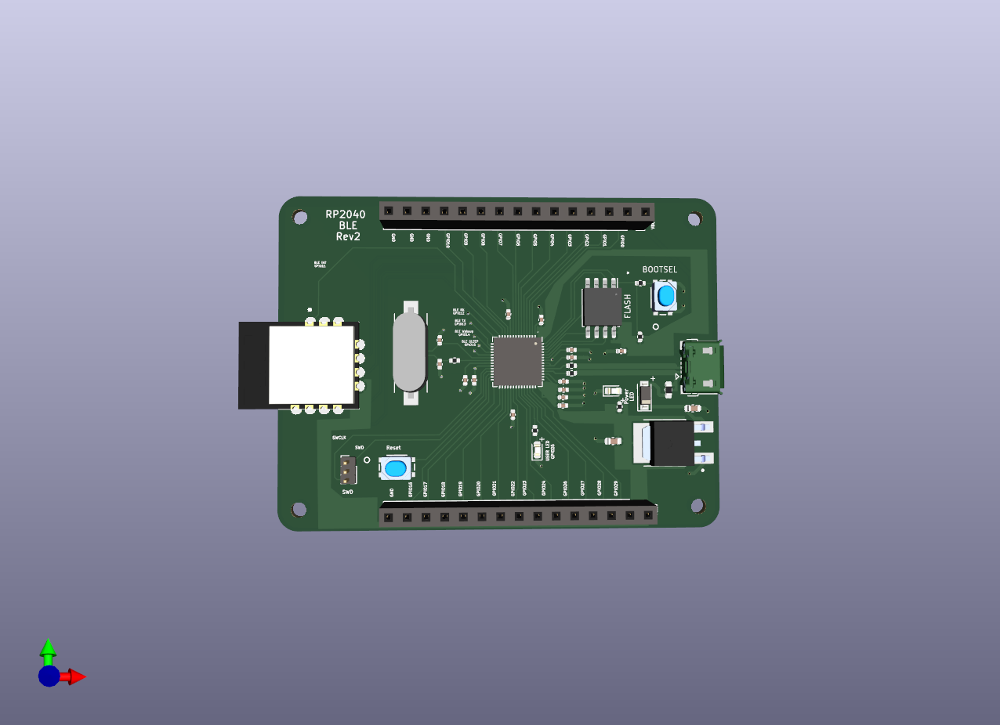

# RP2040 BLE

A PCB that uses RP2040 MCU and HM-BT4502 BLE passthrough module.
This enables the RP2040 to communicated with other devices using Bluetooth.
The bluetooth module is connected via UART(0)

## 3D

## PCB front layer

## PCB back layer

